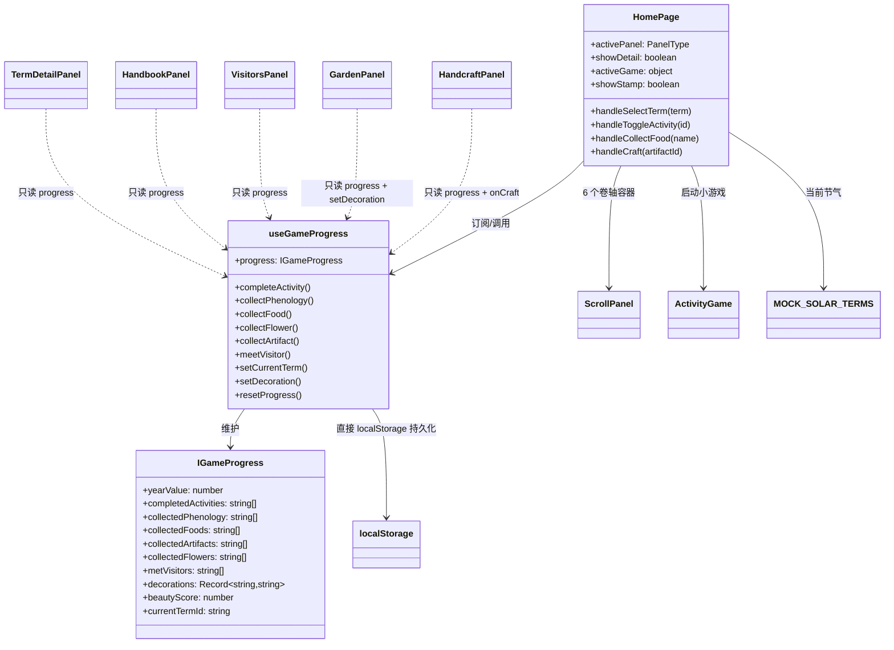

# 岁时记 · 项目架构分析

> 生成日期：基于当前代码仓库（`git` 工作区）实测分析
> 可视化架构图见同目录 **[architecture-diagram.html](./architecture-diagram.html)**（浏览器直接打开）。

---

## 1. 项目定位

「岁时记」是一款**古风悠闲经营游戏**（单页互动应用）：玩家以隐士身份随二十四节气轮转经营庭院，参与节气活动、收集物候风物、邂逅山中访客。

- **形态**：纯前端单页应用（SPA），无后端、无 API
- **数据**：游戏内容全部为内置 mock 常量；玩家进度用 `localStorage` 持久化
- **语言**：中文界面，古风水墨淡彩主题（宣纸米白 + 四季色 + 朱砂印章红）

---

## 2. 技术栈

| 类别 | 选型 |
|---|---|
| 框架 | React 19 + TypeScript 5.9 |
| 构建 | Vite 8（原生配置：`@vitejs/plugin-react` + `@tailwindcss/vite`，纯静态产物） |
| 样式 | Tailwind CSS v4（CSS 变量主题）+ 自绘 `tailwind-theme.css` / `typography.css` |
| 路由 | react-router-dom 7（BrowserRouter） |
| 动画 | framer-motion（面板滑入/轮盘/盖章）+ CSS keyframes（粒子） |
| UI 组件 | shadcn/ui（Radix 封装，`src/components/ui/` 55 个） |
| 图标 / 反馈 | lucide-react / sonner（toast） |
| 平台基建 | 无（完全独立部署：无外部/私有域请求；进度直接 `localStorage`，日志走 `console`） |

---

## 3. 目录结构（实际）

```
24-Solar-Terms/
├── index.html                  # Vite 挂载点（<div id="root">）
├── vite.config.ts              # 别名：@ → src、@shared → shared
├── components.json             # shadcn/ui 配置
├── package.json                # 依赖与脚本
├── AGENTS.md                   # 需求拆解 + UI 设计指南
├── PRO.md / 《岁时记》各模块细化设计文档.md
├── scripts/                    # dev.mjs / build.mjs / setup-git-hooks.mjs
├── .githooks/pre-commit        # git 钩子（prepare 注册 core.hooksPath）
├── public/                     # favicon.svg / icons.svg / images（四季场景与角色 SVG）
├── shared/                     # 仅 README 占位（static 目录未使用）
└── src/
    ├── index.tsx               # 入口：createRoot → BrowserRouter → ErrorBoundary → App
    ├── app.tsx                 # 路由表：HomePage(/) + NotFoundPage(*)
    ├── index.css               # 引入 tailwind + 主题 + 字体
    ├── tailwind-theme.css      # 9 个 CSS token + 四季语义色（379 行）
    ├── typography.css          # 宋体/书法字体排版
    ├── pages/
    │   ├── HomePage/HomePage.tsx       # ★ 游戏主页面 / 编排中枢（401 行）
    │   └── NotFoundPage/NotFoundPage.tsx
    ├── components/             # 15 个业务组件（见 §5）
    │   └── ui/                 # shadcn/ui 基础组件 ×55（勿改）
    ├── hooks/
    │   ├── useGameProgress.ts  # ★ 游戏进度状态中枢（localStorage 持久化）
    │   └── use-mobile.ts       # 移动端检测
    ├── data/                   # 7 个 mock 数据模块
    └── lib/                    # 2 个工具模块
```

---

## 4. 分层架构总览

```
┌─────────────────────────────────────────────────────────────────┐
│  ① 入口与构建层   index.html · vite.config.ts · src/index.tsx    │
├─────────────────────────────────────────────────────────────────┤
│  ② 路由层         src/app.tsx（HomePage / NotFoundPage 直连）      │
├─────────────────────────────────────────────────────────────────┤
│  ③ 页面编排层     HomePage.tsx —— 游戏中枢（状态/事件/渲染编排）   │
├─────────────────────────────────────────────────────────────────┤
│  ④ 业务组件层     常驻场景 ×4 · 卷轴面板 ×7 · 交互特效 ×3         │
├─────────────────────────────────────────────────────────────────┤
│  ⑤ 状态/数据/逻辑  useGameProgress · data ×7 · lib ×2            │
├─────────────────────────────────────────────────────────────────┤
│  ⑥ 基础支撑层     components/ui ×55 · 主题样式 · 外部依赖         │
└─────────────────────────────────────────────────────────────────┘
       数据流：交互 → HomePage 回调 → useGameProgress → localStorage → 各面板 re-render
```

### 4.1 Mermaid 架构图（流程图）

```mermaid
flowchart TB
    subgraph L1["① 入口与构建层"]
        HTML[index.html<br/>Vite 挂载点]
        VITE[vite.config.ts<br/>@ → src]
        ENTRY["src/index.tsx 入口<br/>createRoot → BrowserRouter →<br/>ErrorBoundary → App"]
    end

    subgraph L2["② 路由层 (react-router-dom)"]
        APP["src/app.tsx<br/>Routes: HomePage(/) + NotFound(*)"]
        NF[NotFoundPage.tsx]
    end

    subgraph L3["③ 页面编排层"]
        HOME["HomePage.tsx（401行）<br/>activePanel / showDetail / activeGame / showStamp<br/>事件回调 + 场景渲染"]
    end

    subgraph L4["④ 业务组件层"]
        direction TB
        SCENE["常驻场景：StatusBar · ParticleLayer<br/>TermTimeline · SealButtons"]
        PANELS["卷轴面板（ScrollPanel 容器）：<br/>TermDetailPanel · HandbookPanel · VisitorsPanel<br/>GardenPanel · HandcraftPanel · SettingsPanel"]
        FX["交互特效：SolarWheel · ActivityGame<br/>SealStamp（framer-motion 驱动）"]
    end

    subgraph L5["⑤ 状态/数据/逻辑层"]
        HOOK["hooks/useGameProgress.ts<br/>IGameProgress ×12 字段 ×12 操作<br/>localStorage 持久化"]
        DATA["data/（mock 内置）<br/>solarTerms · crops · items · visitors<br/>flowers · decorations · handcrafts"]
        LIB["lib/<br/>season-images · utils"]
    end

    subgraph L6["⑥ 基础支撑层"]
        UI["components/ui/ ×55<br/>shadcn/ui + Radix"]
        THEME["主题样式<br/>index.css → tailwind-theme.css<br/>+ typography.css"]
        DEPS["外部依赖<br/>React19 · Tailwind4 · framer-motion<br/>lucide · sonner · RRD7 · toolkit"]
    end

    HTML --> ENTRY
    VITE -. 别名支持 .-> ENTRY
    ENTRY -->|渲染| APP
    APP -->|index 路由| HOME
    APP --> NF
    HOME -->|组合| SCENE
    HOME -->|组合| PANELS
    HOME -->|组合| FX
    SCENE & PANELS & FX -->|读写进度 / 读取数据| HOOK
    SCENE & PANELS & FX --> DATA
    SCENE & PANELS & FX --> LIB
    PANELS -->|import| UI
    SCENE & PANELS & FX -. 全局生效 .-> THEME
    HOOK -. 持久化 .-> LS[(localStorage<br/>__game_suishiji_progress_v2)]
```

### 4.2 Mermaid 组件依赖图（类图视角）



---

## 5. 业务组件层明细（15 个）

| 分组 | 组件 | 职责 | 数据依赖 |
|---|---|---|---|
| 常驻场景 | `StatusBar` | 顶部状态栏：节气/天气/岁时值进度/等级里程碑 | solarTerms |
| 常驻场景 | `ParticleLayer` | 季节粒子：落花/萤火/落叶/雪花 | solarTerms(type) |
| 常驻场景 | `TermTimeline` | 24 节气横向时间轴，点击切换 | solarTerms |
| 常驻场景 | `SealButtons` | 右侧印章按钮组，7 个面板入口（移动端底部横排） | — |
| 卷轴面板 | `ScrollPanel` | 卷轴式抽屉容器（side: right/center） | — |
| 卷轴面板 | `TermDetailPanel` | 节气详情：三候/活动/食膳/物候 | solarTerms + progress |
| 卷轴面板 | `HandbookPanel` | 风物志图鉴（物候/食膳/器物/花卉）+ 节气印章/四季徽章/称号 | solarTerms + handcrafts + flowers + progress |
| 卷轴面板 | `VisitorsPanel` | 访客列表 + 选择式对话 + 好感度 + 赠礼（入背包） | visitors + progress |
| 卷轴面板 | `GardenPanel` | 庭院布置（装饰/美观度）+ 菜畦种植（三阶段/收获入背包） | decorations + crops + solarTerms + progress |
| 卷轴面板 | `HandcraftPanel` | 手作工坊：25 种器物，配方消耗背包材料（库存/缺料提示） | handcrafts + items + progress |
| 卷轴面板 | `BackpackPanel` | 背包：作物收成/基础材料/加工制品/访客赠礼四类展示 | items + progress |
| 卷轴面板 | `SettingsPanel` | 设置 / 重置进度 | — |
| 交互特效 | `SolarWheel` | 24 节气轮盘（旋转定位/确认切换） | solarTerms |
| 交互特效 | `ActivityGame` | 互动小游戏：点击收集/分步制作/拖拽匹配（覆盖全部 68 项节气活动） | 内置 GAME_CONFIGS |
| 交互特效 | `SealStamp` | 红色印章盖章动画（完成反馈） | — |

---

## 6. 状态管理与数据流

**唯一状态中枢**：`src/hooks/useGameProgress.ts`

- `IGameProgress`：14 个字段 —— `yearValue`、6 类收集列表、`metVisitors`、`decorations`、`beautyScore`、`currentTermId`、`crops`（种植记录）、`visitorAffinity`（好感度）、`inventory`（背包库存）
- 17 个操作方法，全部走函数式 `setState`（`prev => ...`），**带幂等去重**（重复收集不重复加分）
- **持久化**：直接浏览器 `localStorage`，key = `__game_suishiji_progress_v2`；每次 `progress` 变化自动写入

```
用户交互（点击节气/收集/完成活动）
      │
      ▼
HomePage 事件回调（handleSelectTerm / handleToggleActivity / handleCollect* / handleCraft）
      │ 调用
      ▼
useGameProgress 操作函数（setProgress，幂等去重 + 加分）
      │
      ├──► useState 状态更新 ──► 各面板 props 传递 ──► re-render
      └──► useEffect 自动持久化 ──► localStorage
```

**加分规则**：活动完成 +10 ｜ 物候/食膳/花卉/作物 +5 ｜ 器物(手作) +8 ｜ 访客相遇 +15。

---

## 7. 修复记录（原问题 → 处置）

上一轮分析发现的问题均已修复，记录如下：

| # | 原问题 | 处置 |
|---|---|---|
| 1 | 死代码：`data/foods.ts`、`data/artifacts.ts`、`lib/activity-defs.ts`、`lib/season-palette.ts` 未被引用 | 已删除。数据收敛为单一来源：节气美食/作物内嵌于 `solarTerms.ts`，器物由 `handcrafts.ts` 提供，小游戏逻辑在 `ActivityGame.tsx`，四季色板在 `solarTerms.ts` 的 `SEASON_COLORS` |
| 2 | `scripts/` 缺失，`npm run dev` / `build` 不可用 | 已补齐 `scripts/dev.mjs`（启动 Vite）、`scripts/build.mjs`（tsc + vite build，跨平台替代 bash）、`scripts/setup-git-hooks.mjs`（prepare 注册 core.hooksPath=.githooks）；`package.json` 的 `build` 改为 `node scripts/build.mjs`。实测 `vite build` 通过（2413 模块），dev 服务器正常（http://localhost:8080） |
| 3 | 依赖冗余 | 已从 `package.json` 移除 `gsap`、`@gsap/react`、`react-markdown`、`remark-gfm`、`@formkit/auto-animate`、`date-fns`、`echarts`、`echarts-for-react`、`zod`、`@hookform/resolvers` 等未被代码引用的依赖并同步 lockfile（累计移除 100+ 包）。`echarts` 曾以 lark preset 传递依赖形式存在，随 preset 移除而消失 |
| 4 | README 与现状偏离 | 已重写 `README.md`：更新技术栈、目录结构、命令、业务组件清单、数据与持久化说明、主题变量位置（`tailwind-theme.css`） |
| 5 | 双源数据风险 | 通过删除冗余模块收敛为单一来源（见 #1） |
| 6 | `Layout.tsx` 空壳，路由层级名存实亡 | 已删除空壳 `Layout.tsx`，`app.tsx` 直接注册 `HomePage(/)` 与 `NotFoundPage(*)`，路由结构如实反映单页应用形态 |
| 7 | 功能缺口：活动小游戏仅 12 项/两种模式、无种植、无访客对话、无收集奖励 | 本轮补齐（见下文 §9 功能完成清单） |

**验证结果**：`tsc -p tsconfig.app.json` ✅（0 错误）、`eslint src` ✅（0 错误）、`vite build` ✅、dev 服务器 ✅（HTTP 200）。

---

## 9. 功能完成清单（对照项目文档）

对照《岁时记》各模块细化设计文档 / PRO.md / AGENTS.md 的需求规划，本轮补齐如下：

| 文档规划 | 实现 |
|---|---|
| 节气活动 4 类（互动小游戏/收集任务/制作互动/仪式行为） | `ActivityGame` 实现 **3 种玩法**：点击收集（click-collect）/ 分步制作（click-sequence）/ 拖拽匹配（drag-match）；`GAME_CONFIGS` 覆盖**全部 68 项节气活动**（原仅 12 项且含 1 个无效 id），24 节气全覆盖 |
| 种植系统（设计文档 2.2）：节气作物表、三阶段生长、收获产出 | 新增 `src/data/crops.ts`（16 种作物，`growthHours` 参考实物周期 8–96 小时，游戏内收获时间与实物一致：`growthSec = growthHours × 3600`，离线持续生长）；`GardenPanel` 新增"种植"标签：6 地块、种子→生长→成熟三阶段、实时倒计时、收获产出记入 `collectedCrops` |
| 庭院可点击元素（AGENTS.md：菜畦/花圃/池塘/茶亭） | `HomePage` 庭院图叠加 4 个热区：菜畦→种植、花圃→风物志、池塘/茶亭→节气详情 |
| 访客对话与好感度（设计文档 5.2） | `VisitorsPanel` 选择式对话（每位访客 2 个选项 + 专属回复）、好感度分级（萍水相逢→相谈甚欢→知己）、满好感赠礼 +10 岁时值 |
| 收集奖励（设计文档 6.2）：节气印章/四季徽章/称号 | `HandbookPanel` 顶部奖励条：24 节气印章计数、4 四季徽章计数、72 候集齐得"知天命"称号 |
| 等级里程碑（设计文档 1.3） | `StatusBar` 岁时值 → 等级（每 60 点一级）+ 里程碑文案（菜畦·茶亭 → 岁终团圆） |
| 进度数据模型 | `IGameProgress` 新增 `crops`（种植记录）、`visitorAffinity`（好感度）、`inventory`（背包库存）；新增 `plantCrop` / `harvestCrop` / `boostAffinity` / `addItem` / `craftHandcraft` / `grantVisitorGift` 等操作；旧存档自动合并默认值，向前兼容 |
| 背包系统与手作材料链 | 新增 `src/data/items.ts`（39 种物品：作物收成 / 基础材料 / 加工制品 / 访客赠礼）；三条获取渠道：**种植收获**（水稻→稻米+稻草等，产出入背包）、**节气活动收集**（完成活动得时令材料+随机基础材料）、**访客赠礼**（好感度满入背包）；手作扩充至 **25 种**，每种带配方 `recipe`（如黄麻×3→麻绳、枫桦木×2→木楦、稻草+黄麻+麻绳+木楦→编草鞋），制作时校验并扣除背包库存；新增 `BackpackPanel` 背包面板与 SealButtons 入口 |

**验证**：`tsc` ✅ 0 错误 ｜ `eslint` ✅ 0 错误 ｜ `vite build` ✅（2169 模块，39s）｜ dev 服务器 ✅ 关键模块均 200。

**遗留说明**：
- `shared/` 目录仍为占位（无静态资源），`@shared` 别名保留待用
- `components/ui/` 模板组件中未被业务引用的部分（chart/form/calendar 等）按模板约定保留，其依赖（recharts/react-day-picker/react-hook-form 等）一并保留
- 已脱离飞书平台运行（移除 `@lark-apaas/client-toolkit-lite`），构建产物不再依赖任何私有域请求（字体/图片/日志均已本地化）

---

## 8. 扩展建议（如需继续演进）

- 若要做"节气活动面板"独立入口（AGENTS.md 规划），可复用 `ScrollPanel` + `TermDetailPanel`
- 面板状态可考虑用 `useReducer` 或 zustand 收敛，减少 `HomePage` 单组件内状态膨胀（目前 401 行）
- `HomePage.tsx` 可拆分为场景区 / 面板区 / 事件区子组件，降低单文件复杂度
- 若 `shared/static` 需要承载图片/JSON 资源，可按 README 约定使用 `@shared` 别名
- 大 chunk（toolkit 734KB）可评估分包或按需引入 client-toolkit 能力
